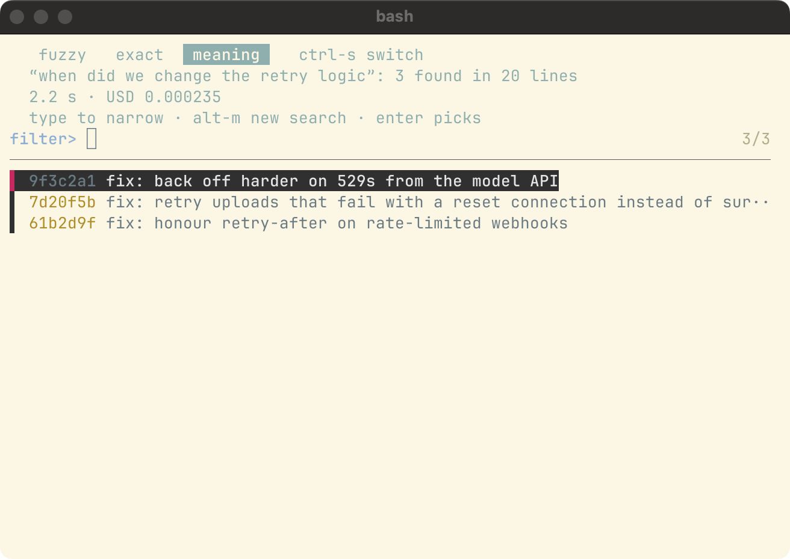
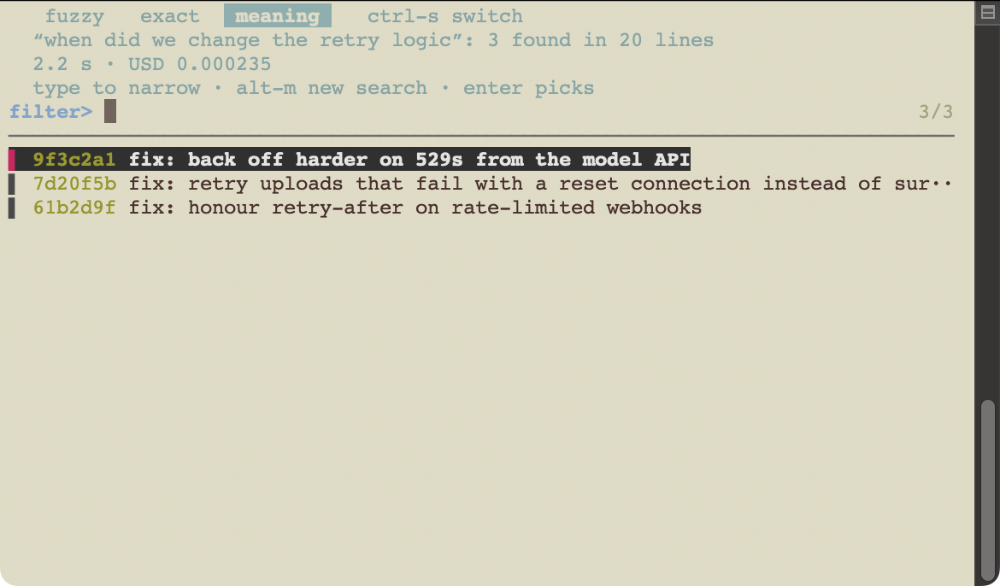

# jevzf picker: stock fzf with a meaning mode

*2026-09-26T07:23:10Z by Showboat 0.6.1*
<!-- showboat-id: 37700d4c-202a-4fcf-a3f7-a0bdac403abb -->

`cmd | jevzf` opens stock fzf over piped text with three modes: fuzzy, exact and meaning. The screens below are the real picker in fzf, captured as text from a hidden tmux session and driven through the picker's own fzf socket against a loopback stand-in for TypeSafe, so nothing is sent and nothing is spent. Search times and the spinner are replaced with `N.N s` and `*` so the blocks re-run identically.

## The fzf it needs

The picker needs fzf 0.66 or newer, for its private Unix-socket `--listen`. An older fzf gets one line naming the fix, and the filter keeps working without fzf.

```bash
node stand-in.mjs 'printf "#!/bin/sh\necho \"0.65.2 (brew)\"\n" > "$HOME/fzf"; chmod +x "$HOME/fzf"; echo login | JEVZF_FZF="$HOME/fzf" jevzf; echo "exit $?"'
```

```output
jevzf: the picker needs fzf 0.66 or newer, found 0.65.2; install it with brew install fzf (or set JEVZF_FZF), or use the filter: cmd | jevzf QUERY
exit 2
```

## Fuzzy, then meaning, then results

Each case below is one picker session at 80 columns: fuzzy with typed words, the same words in meaning mode with the cost shown before anything is sent, the search running, and the ranked results with the words moved to the header.

```bash
T=$(mktemp -d) && sh ../../scripts/legibility-shots.sh --check --only wezterm-dark-80x24 "$T" > /dev/null && for s in fuzzy ask running results; do echo "--- $s"; sed -e 's/[0-9][0-9]*\.[0-9] s /N.N s /' -e 's/[⠀-⣿]/*/g' -e 's/ *$//' "$T/wezterm-dark-80x24-$s.txt" | sed -n 1,9p; done; rm -rf "$T"
```

```output
--- fuzzy
   fuzzy   exact   meaning    ctrl-s switch
  enter picks · alt-m searches by meaning
fuzzy> fix retry                                                           2/20
───────────────────────────────────────────────────────────────────────────────
▌ 61b2d9f fix: honour retry-after on rate-limited webhooks
▌ 7d20f5b fix: retry uploads that fail with a reset connection instead of sur··


--- ask
   fuzzy   exact   meaning    ctrl-s switch
  Type what you mean, then press enter · 20 lines
  about USD 0.00018 · never more than USD 0.02 per search · USD 0.20 left today
meaning> when did we change the retry logic                               20/20
───────────────────────────────────────────────────────────────────────────────
▌ 9f3c2a1 fix: back off harder on 529s from the model API                      │
▌ 4b7e0d2 feat: add dark mode toggle to settings                               │
▌ c81a9e4 chore: bump eslint to 9.12                                           │
▌ 7d20f5b fix: retry uploads that fail with a reset connection instead of sur··│
--- running
   fuzzy   exact   meaning    ctrl-s switch
  Searching for “when did we change the retry logic” by meaning…
filter>                                                                   * 0/0
───────────────────────────────────────────────────────────────────────────────


--- results
   fuzzy   exact   meaning    ctrl-s switch
  “when did we change the retry logic”: 3 found in 20 lines
  N.N s · USD 0.000235
  type to narrow · alt-m new search · enter picks
filter>                                                                     3/3
───────────────────────────────────────────────────────────────────────────────
▌ 9f3c2a1 fix: back off harder on 529s from the model API
▌ 7d20f5b fix: retry uploads that fail with a reset connection instead of sur··
▌ 61b2d9f fix: honour retry-after on rate-limited webhooks
```

## Without a key, and in narrow or plain terminals

Without a key the picker still opens and meaning mode says what to export. At 60 columns the header wraps between its parts, never through the key hint. Without a UTF-8 locale the separators and quotes fall back to ASCII and fzf draws without Unicode; under `NO_COLOR` the mode is marked in brackets.

```bash
T=$(mktemp -d) && sh ../../scripts/legibility-shots.sh --check --only wezterm-dark-80x24-nokey,wezterm-dark-60x24,wezterm-minimal-locale-80x24,wezterm-no-color-80x24 "$T" > /dev/null && for c in wezterm-dark-80x24-nokey-ask wezterm-dark-60x24-results wezterm-minimal-locale-80x24-results wezterm-no-color-80x24-results; do echo "--- $c"; sed -e 's/[0-9][0-9]*\.[0-9] s /N.N s /' -e 's/ *$//' "$T/$c.txt" | sed -n 1,7p; done; rm -rf "$T"
```

```output
--- wezterm-dark-80x24-nokey-ask
   fuzzy   exact   meaning    ctrl-s switch
  Meaning search needs a TypeSafe key · export TYPESAFE_API_KEY
meaning> when did we change the retry logic                               20/20
───────────────────────────────────────────────────────────────────────────────
▌ 9f3c2a1 fix: back off harder on 529s from the model API
▌ 4b7e0d2 feat: add dark mode toggle to settings
▌ c81a9e4 chore: bump eslint to 9.12
--- wezterm-dark-60x24-results
   fuzzy   exact   meaning    ctrl-s switch
  “when did we change the retry logic”: 3 found in 20 lines
  N.N s · USD 0.000235
  type to narrow · alt-m new search · enter picks
filter>                                                 3/3
───────────────────────────────────────────────────────────
▌ 9f3c2a1 fix: back off harder on 529s from the model API
--- wezterm-minimal-locale-80x24-results
   fuzzy   exact   meaning    ctrl-s switch
  "when did we change the retry logic": 3 found in 20 lines
  N.N s | USD 0.000235
  type to narrow | alt-m new search | enter picks
filter>                                                                     3/3
-------------------------------------------------------------------------------
> 9f3c2a1 fix: back off harder on 529s from the model API
--- wezterm-no-color-80x24-results
   fuzzy   exact  [meaning]   ctrl-s switch
  “when did we change the retry logic”: 3 found in 20 lines
  N.N s · USD 0.000235
  type to narrow · alt-m new search · enter picks
filter>                                                                     3/3
───────────────────────────────────────────────────────────────────────────────
▌ 9f3c2a1 fix: back off harder on 529s from the model API
```

## Real terminals

These are the captain's own screenshots, taken with `scripts/legibility-shots.sh` in WezTerm and Terminal.app. On light themes they showed the header in fzf's fixed grey-blue fading into the background, so the header now uses the terminal's own text colour; the shots below are from before that change.

```bash {image}

```


```bash {image}

```



```bash {image}

```


